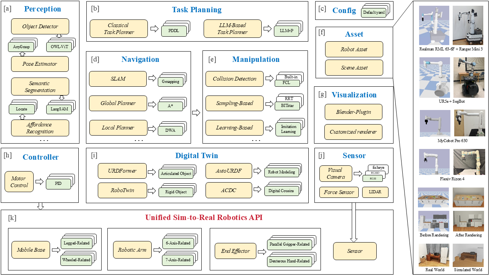

<!-- 

 -->

<h1 align=""><strong>BestMan-Sim-Bullet</strong></h1>

## 📋 Contents

- [📋 Contents](#-contents)
- [🏠 What](#-what)
- [🚀 Update](#-update)
- [🎯 Framework](#-framework)
- [🏠 How to Install](#-how-to-install)
  - [Prerequisites](#prerequisites)
  - [Installation](#installation)
- [👨‍💻 How to Use](#-how-to-use)
- [📄 License](#-license)
- [👏 Acknowledgements](#-acknowledgements)

## 🏠 What
BestMan-Sim-Bullet is A mobile manipulator (with a wheel-base and arm) platform built on PyBullet simulation with unified hardware APIs.
 It features several advancements:
* 🏙️ <b>Assets</b>, the assets include a large and diverse collection of scenes, objects, and robots..
* 🤖 <b>Unified Robotics APIs</b>, for both simulation and real devices, the Unified Robotics APIs offers multilevel technical integration.
* 🧑‍🤝‍🧑 <b>Modular Platform</b>, The modular design includes various modules like perception and control, making it highly extensible and developer-friendly for additional functionalities.

## 🚀 Update

- \[V1.0.0\] Release the platform with basic modules、functions and demos.

## 🎯 Framework

## 🏠 How to Install

### Prerequisites

> ***Note**: We recommand Ubuntu 22.04 and python version deault to 3.8.*

- Ubuntu 20.04, 22.04
- Conda 
  - Python 3.8, 3.9, 3.10

### Installation

We provide the installation guide [here](Install/install.md). You can install locally or use docker and verify the installation easily.

## 👨‍💻 How to Use

Enter `Examples` directory and run the demos. You can also modify the parameters corresponding to the demo.

## 📄 License

BestMan-Sim-Bullet is MIT licensed. The open-sourced BestMan-Sim-Bullet are under the <a href="http://creativecommons.org/licenses/by-nc-sa/4.0/">Creative Commons Attribution-NonCommercial-ShareAlike 4.0 International License Creative Commons License.</a>

## 👏 Acknowledgements

This project is developed based on the branch <a href="https://github.com/AutonoBot-Lab/BestMan">BestMan</a>, and will be independently maintained by our company to ensure faster update cycles.
 We would like to express our sincere gratitude to all the individuals and organizations who contributed to this project.
